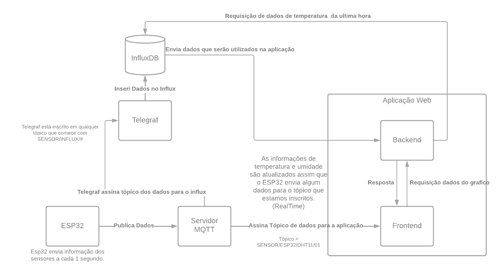
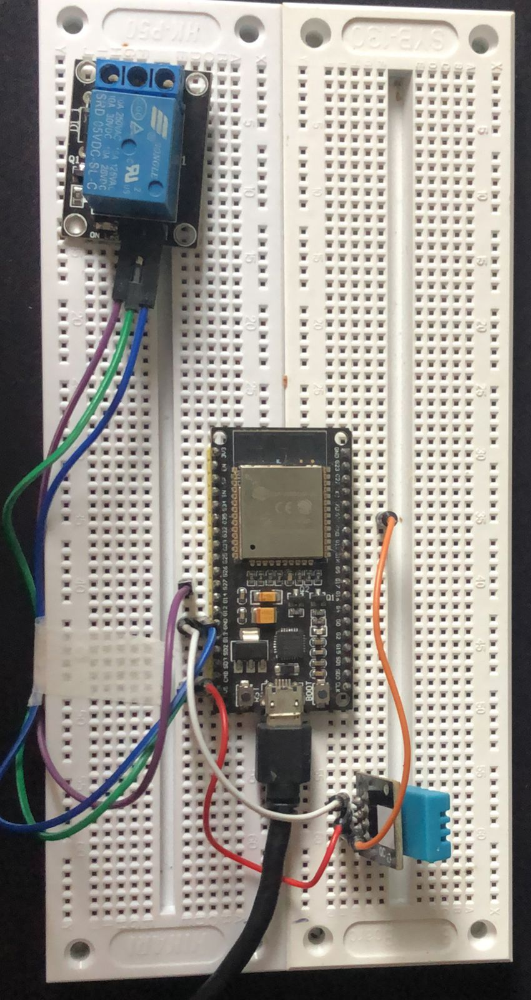

# iot-home

## Objetivo

O objetivo deste projeto é criar um sistema para monitorar a temperatura e umidade de um ambiente, além de permitir o controle remoto de um Relay. O sistema terá a capacidade de coletar e armazenar dados de temperatura e umidade. Será possível visualizar os valores dos sensores em tempo real através de uma interface gráfica fornecida pelo sistema. O controle do Relay será realizado através de um dispositivo de hardware conectado ao sistema, que poderá ser acionado remotamente. O sistema será desenvolvido utilizando tecnologias como Node.js, Nest, GraphQL, React, Apollo Client, Material UI, ESP32, Mosquitto, InfluxDB e Telegraf.

## Observação

Para executar o projeto localmente, é necessário ter o Docker e o Docker Compose instalados no computador. Isso porque o projeto faz uso de diversos serviços e componentes, que são executados em contêineres Docker e gerenciados pelo Docker Compose. Dessa forma, é possível garantir a compatibilidade e a replicabilidade do ambiente de execução em diferentes máquinas.

## Hardware

O projeto faz uso dos seguintes componentes de hardware:

- ESP32
- DHT11
- Relay
- Jumpers

## Tecnologias Utilizadas

Backend

- Linguagem: Node.js
- Framework: Nest
- Bancos de dados: Postgres (utilizado com Prisma)
- Servidor de GraphQL: Apollo Server
- Biblioteca de GraphQL: GraphQL

Frontend

- Biblioteca de UI: React
- Biblioteca de gerenciamento de estado: Apollo Client
- Biblioteca de UI: Material UI

Hardware

- Plataforma: ESP32
- Linguagem: C

Broker
-Servidor: Mosquitto

Armazenamento dos sensores

- Banco de dados: InfluxDB
- Agente de coleta de dados: Telegraf (utilizado em conjunto com o InfluxDB)

O fluxo começa com o ESP32 coletando informações de temperatura e umidade e enviando essas informações para dois tópicos MQTT diferentes. O primeiro tópico, SENSOR/ESP32/DHT11/01, é usado para enviar as informações coletadas diretamente do sensor DHT11 conectado ao ESP32. O segundo tópico, SENSOR/INFLUX/DHT11/01, é usado para enviar as informações para um servidor InfluxDB, onde os dados podem ser armazenados e posteriormente consultados para análise ou visualização.

Essa abordagem de enviar dados para um servidor InfluxDB em vez de simplesmente publicá-los em um tópico MQTT tem algumas vantagens. Primeiro, os dados podem ser armazenados em um banco de dados de séries temporais otimizado para armazenamento e consulta eficientes de dados de séries temporais. Em segundo lugar, o servidor InfluxDB pode ser configurado para processar e analisar automaticamente os dados recebidos, permitindo que você execute cálculos complexos.

Imagem 1: Fluxo referente aos dados do sensor DHT11

O sistema também possui um segundo fluxo de informações, que trata dos dados enviados para o ESP32 a partir da aplicação web. Nesse fluxo, utilizamos o Telegraf para escutar o tópico "ACTUADOR/INFLUX/#", permitindo que possamos armazenar no banco de dados InfluxDB informações sobre o momento em que o Relay foi ligado através da aplicação web. Esse fluxo é semelhante ao primeiro, porém inclui a capacidade de monitorar e armazenar informações sobre o controle remoto do Relay através da interface da aplicação web.

Imagem 2: Foto do circuito com ESP32, Relay e DHT11
